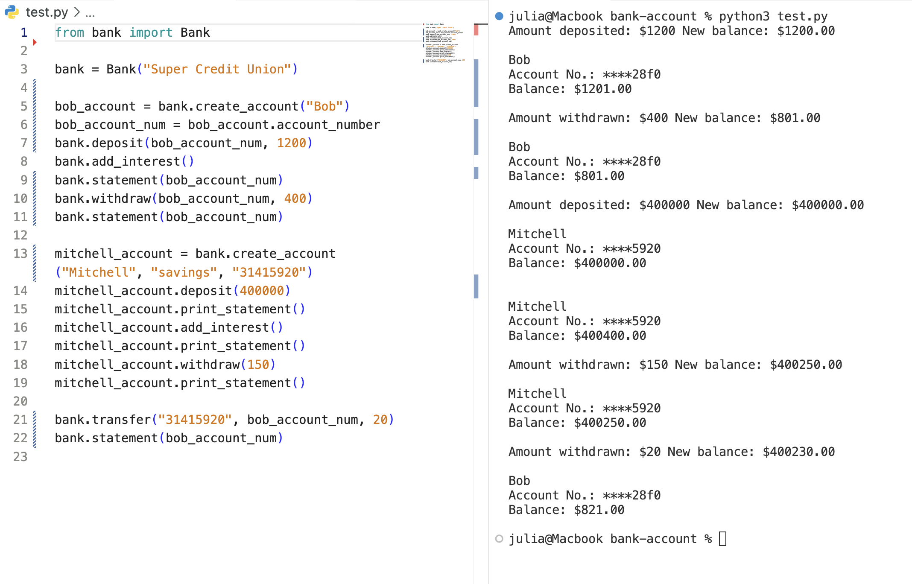
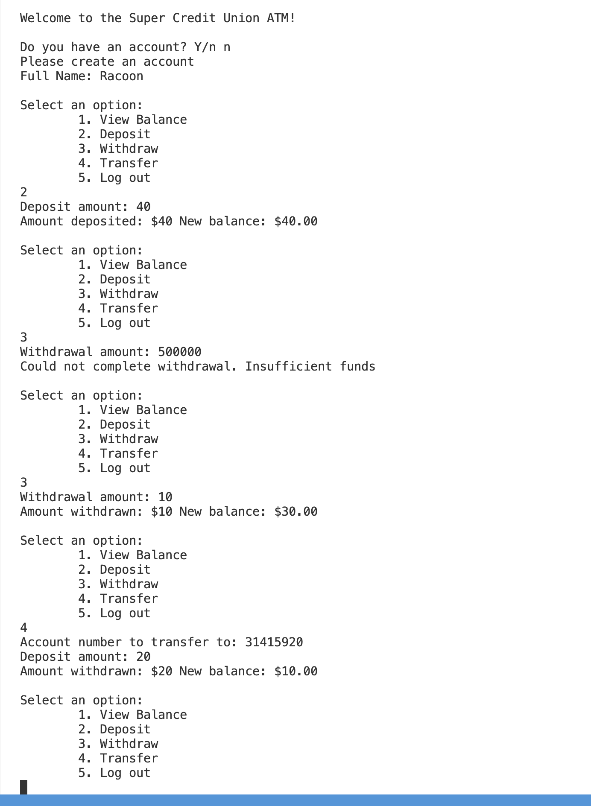

### Bank Account 

A Python program that simulates a bank account, using object-oriented programming concepts.

#### Resources
- [Python class docstrings](https://www.programiz.com/python-programming/docstrings)
- [UUIDs](https://docs.python.org/3/library/uuid.html)
- [Faux UUID](https://stackoverflow.com/questions/13484726/safe-enough-8-character-short-unique-random-string) `str(uuid.uuid4())[:8]`
- [Round to 2 decimal places](https://stackoverflow.com/questions/5202233/how-to-change-39-54484700000000-to-39-54-and-using-python)
- [Enums in Python](https://docs.python.org/3/library/enum.html)

#### test.py
The manually created Bank and BankAccount instances & methods
(`python3 test.py`)

#### main.py
The application & prompts for user input (`python3 main.py`)

#### Stretch Goals
- [x] Add account type attribute (checking/savings)
- [x] Function loops over all accounts and calls `add_interest`
- [x] Create an "application" that prompts for an action (atm.py)
   - [x] Create account
   - [x] Statement
   - [x] Deposit
   - [x] Withdraw
   - [x] Transfer
- [x] Create `Bank` class to store `BankAccounts` list
  - [x] `create_account()`
  - [x] `deposit()`
  - [x] `withdraw()`
  - [x] `transfer()`
  - [x] `statement()`
